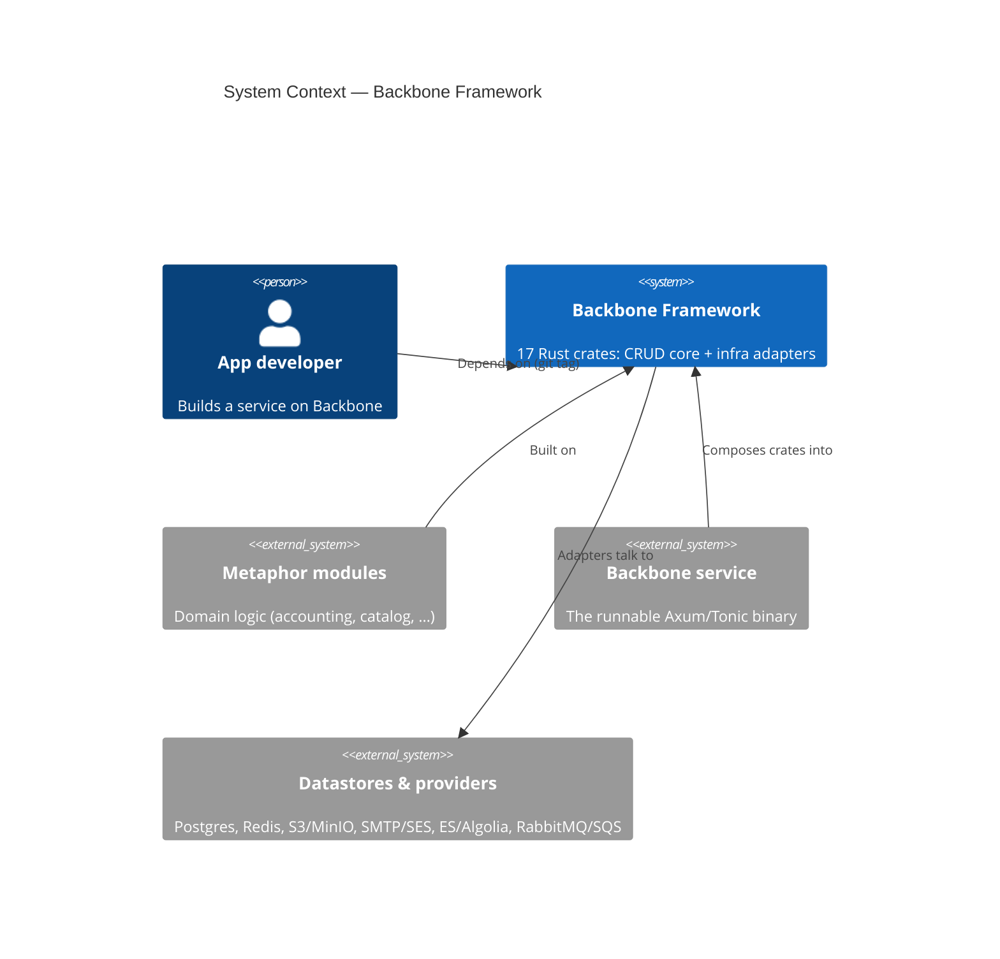
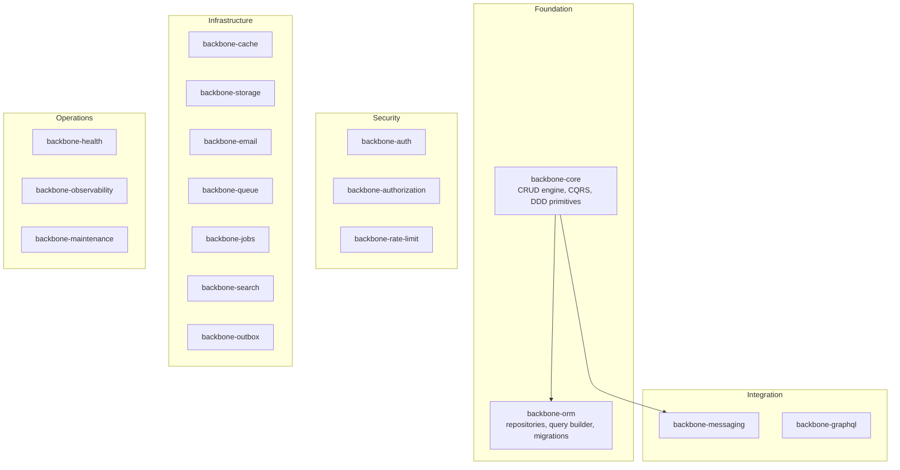

<!-- Reader: Maintainer · Mode: Explanation -->
# Architecture

Backbone is a **Cargo workspace of 17 focused crates**. One crate,
[`backbone-core`](../backbone-core/), holds the domain primitives and the generic
CRUD engine; the rest are infrastructure adapters, each owning a single concern
behind a trait. Nothing in the framework is a runnable binary — these are
libraries a *service* composes. This page goes top-down: the system in its
context, the crates as containers, the internal layering, and one CRUD request
traced end to end.

## 1. Context

Backbone is the plumbing tier. Above it sit the domain **modules** and the
runnable **service**; below it sit the datastores and providers its adapters talk
to. App developers consume it as **git dependencies pinned to a tag**, never from
crates.io.



*What to notice: Backbone never runs on its own. It is composed into a service;
domain logic lives in modules, not here.*

## 2. Containers — the crates

Each member crate is an independently usable library. `backbone-core` and
`backbone-orm` form the foundation; every other crate is an optional capability
you add only if your service needs it.



*What to notice: only two solid dependency edges exist inside the framework —
`backbone-core` depends on `backbone-orm` (persistence traits) and
`backbone-messaging` (CRUD event publishing). Everything else is a leaf a service
opts into. The crates do **not** form a deep dependency tree; they form a flat
menu.*

### The 17 crates

| Group | Crate | Concern | Pluggable backends |
|-------|-------|---------|--------------------|
| Foundation | `backbone-core` | CRUD engine, CQRS, flows, state machines, policies, DDD primitives, module registry | Postgres · in-memory |
| Foundation | `backbone-orm` | Repository pattern, query builder, filtering, migrations, seeding | Postgres |
| Security | `backbone-auth` | JWT, password hashing, sessions, audit, middleware | — |
| Security | `backbone-authorization` | Policies, permission cache, RBAC middleware | — |
| Security | `backbone-rate-limit` | Rate limiting + HTTP middleware | Memory · Redis (dual, with fallback) |
| Infrastructure | `backbone-cache` | Caching abstraction | Memory · Redis |
| Infrastructure | `backbone-storage` | Object storage, compression, security scanning | S3 · MinIO · Local |
| Infrastructure | `backbone-email` | Transactional email | SMTP · SES · Mailgun |
| Infrastructure | `backbone-queue` | Job/message queues; FIFO, dedupe, compression, monitoring | Redis · RabbitMQ · SQS |
| Infrastructure | `backbone-jobs` | Scheduled jobs | cron · pg_cron · in-memory · persistent |
| Infrastructure | `backbone-search` | Search abstraction | Elasticsearch · Algolia |
| Infrastructure | `backbone-outbox` | Transactional outbox + relay + inbox for exactly-once event delivery (composes `backbone-messaging`, no broker) | Postgres |
| Integration | `backbone-messaging` | Event bus, integration bus, CRUD event envelopes | — |
| Integration | `backbone-graphql` | GraphQL helpers: pagination, error mapping | — |
| Operations | `backbone-health` | Health checks, readiness/liveness | — |
| Operations | `backbone-observability` | Logging, tracing, metrics, middleware | — |
| Operations | `backbone-maintenance` | Maintenance-mode gate: `503` + `Retry-After` unless the path is allow-listed | — |

> All **17** members of the workspace [`Cargo.toml`](../Cargo.toml) appear above
> and in the root [`README.md`](../README.md). (`backbone-maintenance` and
> `backbone-outbox` were previously missing from the README table — reconciled.)

## 3. Components / modules — inside `backbone-core`

`backbone-core` is layered in the DDD spirit: domain primitives at the bottom
depend on nothing; the transport adapters at the top depend inward. The generic
CRUD engine is the seam that lets one service implementation serve every entity.

| Layer | Modules (in `backbone-core/src/`) | May depend on |
|-------|-----------------------------------|---------------|
| **Domain** | `entity`, `aggregate`, `value_object`, `specification`, `state_machine`, `flow`, `policy`, `command`, `query`, `cqrs` | nothing |
| **Application** | `service` / `crud` (the `CrudService` trait), `usecase`, `domain_service`, `projection`, `registry`, `module` / `module_registry` (Laravel-style service providers) | domain |
| **Infrastructure** | `persistence` (`traits`, `postgres`, `memory`, `adapter`), `repository`, `config`, `builder` — plus [`backbone-orm`](../backbone-orm/) | domain, application |
| **Presentation** | `http` (Axum `BackboneCrudHandler`), `grpc` (Tonic), `graphql`, `extractors` (`JsonOrForm`), `openapi` | application |

The **CRUD engine** is the key abstraction. You implement the `CrudService` trait
once for an entity; `BackboneCrudHandler::routes(...)` then generates the full
standard endpoint set as an Axum `Router`, and the gRPC layer exposes the same
operations. Consistency is a property of the generic code, not per-entity
discipline. See [`backbone-core/docs/architecture.md`](../backbone-core/docs/architecture.md)
for the crate-internal detail.

## 4. Data & control flow — a `GET /api/v1/{collection}` request

Tracing a paginated **list** request shows where each cross-cutting concern
applies. The order matters: **field-level security runs before sparse
projection**, so a `?fields=` request can never widen the visibility ceiling.

```mermaid
sequenceDiagram
    actor Client
    participant Axum as Axum Router (backbone-core::http)
    participant Svc as CrudService impl
    participant Repo as backbone-orm repository
    participant PG as Postgres
    Client->>Axum: GET /api/v1/users?page=1&per_page=50&filter&sort
    Note over Axum: clamp per_page to MAX_PER_PAGE (100);<br/>reject offset > MAX_PAGINATION_OFFSET (10000) → 400;<br/>strip reserved keys: fields, include, with
    Axum->>Svc: list(ListQueryParams)
    Svc->>Repo: query(filter, sort, page)
    Repo->>PG: SELECT … WHERE … LIMIT … OFFSET …
    PG-->>Repo: rows
    Repo-->>Svc: entities
    Note over Svc: apply @private/@owner field security (AccessScope);<br/>expand ?include= relations (batched, no N+1);<br/>apply ?fields= sparse projection
    Svc-->>Axum: PaginatedApiResponse
    Axum-->>Client: 200 JSON envelope
```

*What to notice: the transport layer enforces the pagination guard-rails
(`MAX_PER_PAGE`, `MAX_PAGINATION_OFFSET`) and strips response-shaping keys before
they can reach the `WHERE` clause; the service layer enforces the security
ceiling before any client-controlled projection. An unknown filter/sort key
surfaces as a `400`, not a `500` — see the [CHANGELOG](../CHANGELOG.md) for the
version each guard landed.*

## Key decisions

Why this architecture and not another — the ADRs carry the reasoning:

- [ADR-0001](adr/adr-0001-git-tag-distribution.md) — distribution via git tags.
- [ADR-0002](adr/adr-0002-self-describing-crates.md) — self-describing crates, no workspace dependency inheritance.
- [ADR-0003](adr/adr-0003-protocol-agnostic-core.md) — protocol-agnostic core, pluggable backends.
- [ADR-0004](adr/adr-0004-monorepo-versioning.md) — one version for the whole workspace.
